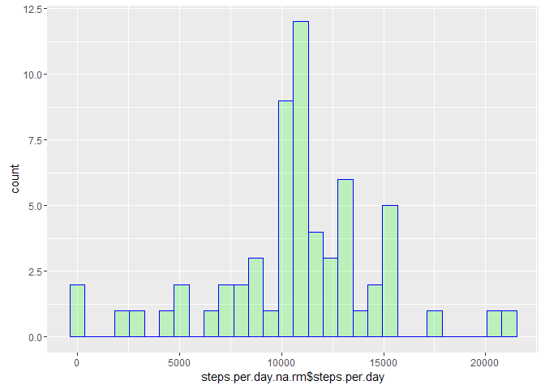

# Reproducible Research: Peer Assessment 1


## Loading and preprocessing the data

Source raw data is collected in csv format, with single header row and comma as separator.
There are three columns - *steps*, *date*, and *interval*.
I think it's logical to merge *date* and *interval* into a single time column
with POSIX datetime type and convert *steps* to the numeric data type. 


```r
library("plyr")
library("lubridate")
library("ggplot2")

if (!dir.exists("./data")) {
  unzip("./activity.zip", exdir = "./data")
}

process.data <- function (arg) {
  steps <- as.numeric(arg[,"steps"], na.omit = TRUE)
  date <- as.Date(arg[,"date"])
  interval <- as.numeric(arg[,"interval"], na.omit = TRUE)
  time <- as.POSIXct(
    strptime(
      paste(date, paste(as.integer(interval / 100),
                        as.integer(interval %% 100), sep = ":"),
            sep = " "),
      "%Y-%m-%d %H:%M"), tz = "UTC")
  data.frame(time, steps)
}

processed.data <- process.data(
  read.csv(file = "./data/activity.csv", sep = ",", stringsAsFactors = FALSE)
)
```

Let's take a first look at the processed data


```r
summary(processed.data)
```

```
##       time                         steps       
##  Min.   :2012-10-01 00:00:00   Min.   :  0.00  
##  1st Qu.:2012-10-16 05:58:45   1st Qu.:  0.00  
##  Median :2012-10-31 11:57:30   Median :  0.00  
##  Mean   :2012-10-31 11:57:30   Mean   : 37.38  
##  3rd Qu.:2012-11-15 17:56:15   3rd Qu.: 12.00  
##  Max.   :2012-11-30 23:55:00   Max.   :806.00  
##                                NA's   :2304
```
## What is mean total number of steps taken per day?

At first, let's group our table by date using *sum()* as the aggregate function assuming that NA is zero.


```r
steps.per.day <- with(processed.data, {
  u <- data.frame(date = date(time), steps)
  ddply(u, c("date"), summarise, steps.per.day = sum(steps))
})
```

Let's build a histogram to see a frequency distribution over a quantitive variable.


```r
qplot(steps.per.day, 
      data=subset(steps.per.day,
                  !is.na(steps.per.day)),
      geom = c("histogram"),
      fill=I("green"), 
      col=I("blue"), 
      alpha=I(.2))
```

<!-- -->

The mean value of the variable in histogram is 10766.19, median is 10765.

## What is the average daily activity pattern?

In descriptive statistics, a box plot or boxplot is a convenient way of graphically depicting groups of numerical data through their quartiles. But the span of measurements is very wide for this kind of chart, so let's take them by log10. 


```r
steps.by.hh <- with(processed.data, {
  data.frame(hour = as.factor(sprintf("%02i", hour(time))), steps)
})

qplot(hour, 
      log10(steps),
      data = steps.by.hh,
      geom = c("boxplot"),
      fill=I("green"), 
      col=I("blue"), 
      alpha=I(.2), na.rm=TRUE)
```

<!-- -->

```r
mean.steps.by.hhmm <- with(processed.data, {
  u <- na.omit(data.frame(hhmm = as.factor(sprintf("%02i:%02i", hour(time), minute(time))), steps))
  ddply(u, c("hhmm"), summarise, mean = mean(steps))
})

max.mean.steps.by.hhmm <- mean.steps.by.hhmm[mean.steps.by.hhmm$mean == max(mean.steps.by.hhmm$mean),]
```

At average, max physical activity being recorded is at 08:35 o'clock

## Imputing missing values

There are 0 and 2304 *NA* values
in the *time* and *steps* columns, respectively.


```r
processed.data.na.rm <- with(processed.data, {
  a <- data.frame(hhmm = as.factor(sprintf("%02i:%02i", hour(time), minute(time))), time, steps)
  c <- a[!is.na(a$steps),]
  b <- join(a[is.na(a$steps),],
            ddply(c, c("hhmm"), summarise,
                  mean = as.integer(mean(steps))),
            by="hhmm", type = "inner")
  rbind(data.frame(time = b$time, steps = b$mean),
        data.frame(time = c$time, steps = c$steps))
})
```

Make a histogram of the total number of steps taken each day and Calculate and report the mean and median total number of steps taken per day.


```r
steps.per.day.na.rm <- with(processed.data.na.rm, {
  u <- data.frame(date = date(time), steps)
  ddply(u, c("date"), summarise, steps.per.day = sum(steps))
})

qplot(steps.per.day.na.rm$steps.per.day, 
      data=steps.per.day.na.rm,
      geom = c("histogram"),
      fill=I("green"), 
      col=I("blue"), 
      alpha=I(.2))
```

<!-- -->

The mean value of the variable in histogram is 10749.77, median is 10641.
The overall impact if these manipulations with *NA* values is that number of mean measurements
got increased by (count(na) / count(!na)) * 100 percent. Let's calculate it.


```r
sum(is.na(processed.data$steps)) / sum(!is.na(processed.data$steps)) * 100.
```

```
## [1] 15.09434
```


## Are there differences in activity patterns between weekdays and weekends?

Let's add an additional boolean column to the data frame - *weekend*.


```r
processed.data.we <- with(processed.data, {
  data.frame(weekend = as.factor(
    ifelse(grepl("S(at|un)", wday(time, label=TRUE)), "Sat-Sun", "Mon-Fri")),
             time, 
             steps)
})
```

Now we're ready to build a time series plot two facets. 


```r
mean.steps.by.hh.we <- with(processed.data.we, {
  c <- data.frame(weekend = weekend, hour = as.factor(sprintf("%02i", hour(time))), steps)
  ddply(c, c("weekend", "hour"), summarise, steps = as.integer(mean(steps, na.rm = TRUE)))
})

qplot(hour, steps, group=1, data = mean.steps.by.hh.we, geom = c("point", "smooth")) + facet_grid(weekend ~ .)
```

<!-- -->
